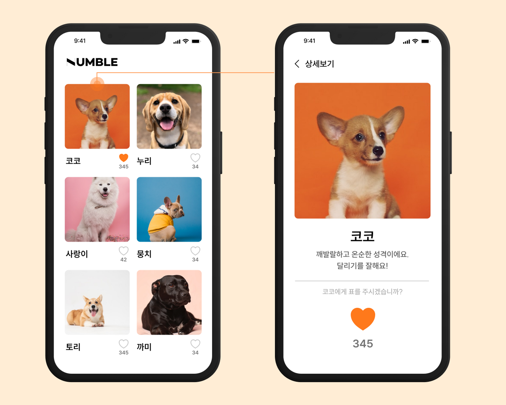

# popular-vote-architecture
Redis와 Kafka, Spring을 활용한 강아지 인기투표 아키텍쳐 만들기

### 구현범위
- 기본적으로 카프카/레디스/백엔드/DB 4가지 시스템을 필수로 구성합니다.
- 카프카와 레디스의 경우 클라우드 컴퓨팅 환경(AWS, GCP 등)을 사용할 경우 리눅스 서버 인스턴스에 직접 설치하고 환경을 설정하여 구성합니다.
- 백엔드의 경우 Java/Kotlin 둘 중 어떤 언어로 구현해도 상관없으며, 프레임워크도 Spring Boot로 Rest API를 구현하거나 Spring MVC로 직접 웹페이지와 같이 구현해도 무방합니다. 다만, API로 구현하든 웹 페이지로 구현하든 가능하면 Spring Boot 프레임워크를 사용하는 것을 권장합니다.

---

### 구현기능
- 아래와 같은API 또는 페이지를 구현 (API로 구현 시 GET/POST 방식을 적절히 디자인해서 구현하도록 하며, 응답의 경우 JSON형식으로 응답되도록 한다.)
    1. 강아지 목록을 조회하는 API 또는 웹 페이지 (초기 데이터로 강아지의 수는 최소 5개 이상으로 데이터를 추가해 놓는다.)
        1. 페이지네이션도 구현되어야 합니다.
        2. 강아지의 데이터베이스의 레코드 PK, 이름, 사진, 간단한 설명과 현재 득표수 정보를 포함해야 합니다.
        3. 조회 시엔 레디스에 캐시된 정보가 있을 경우, 레디스에서 정보를 가져오고, 없다면 데이터베이스에서 데이터를 불러와서 이 후에 사용될 수 있게 레디스에 저장한 뒤 응답으로 내려줍니다.
        4. (선택사항) 필터나 정렬 기능을 포함해주시면 구현 가산점이 있습니다.
    2. 강아지의 상세 정보 조회 API 또는 웹 페이지
        1. 강아지의 데이터베이스의 레코드 PK, 이름, 사진, 간단한 설명, 상세 설명과 현재 득표수 정보를 포함해야 합니다. (그 외에 추가 정보를 자율적으로 넣으셔도 됩니다.)
        2. 조회 시엔 레디스에 캐시된 정보가 있을 경우, 레디스에서 정보를 가져오고, 없다면 데이터베이스에서 데이터를 불러와서 이 후에 사용될 수 있게 레디스에 저장한 뒤 응답으로 내려줍니다.
    3. 투표하기 / 투표 취소 API 또는 페이지
        1. 요청에는 강아지의 데이터베이스의 레코드 PK가 포함되어 백엔드에서 어떤 강아지에 투표 +1 를 해야할지 알도록 구현합니다.
        2. 백엔드에서는 요청이 들어오면 카프카로 이벤트를 Produce 해서 강아지의 PK 값과 투표 또는 투표 취소 구분값을 같이 보내도록 합니다.
        3. (선택사항) 본 딥다이브에서는 사용자 회원 가입을 구현하지 않으므로 중복 투표를 방지하기 위해 HTTP 요청 헤더의 IP를 이용하거나, 이메일 인증이나, 쿠키 값을 사용하는 등의 중복 투표를 방지하기 위한 조치가 필요합니다. 구현 가산점이 있습니다.
    4. 투표 처리 백엔드
        1. Spring 에서 카프카 Consumer를 구현하여 3번에서 Produce한 이벤트를 전달 받습니다.
        2. 이벤트 내용을 통해 데이터베이스에 강아지의 투표 값을 업데이트 합니다.
        3. 데이터베이스에 업데이트가 되면 이어서 레디스에도 업데이트 된 강아지의 정보만 새로운 득표 수와 함께 업데이트 합니다. (이후, 1번, 2번에서 레디스를 통해 새로운 정보를 조회할 수 있도록)
- 레디스에 저장 시, Spring Cache를 사용하여 어노테이션을 통해 메소드 단위로 구현해도 되고 직접 RedisTemplate 등을 활용하여 serialization 된 데이터를 저장해도 무방합니다. (점수 차이 없음)
- 프론트엔드 구현의 경우 평가에 반영되지 않습니다.
- 필수 구현 내용은 아니지만 코드 디자인을 CQRS 패턴을 적용해서 구현하면 코드 설계 부분에 가산점이 있습니다. 다만, 큰 가산점은 아니기 때문에 적용이 어려우실 경우 설계 및 구현과 클린 코드에 집중하시는 것을 권장합니다.